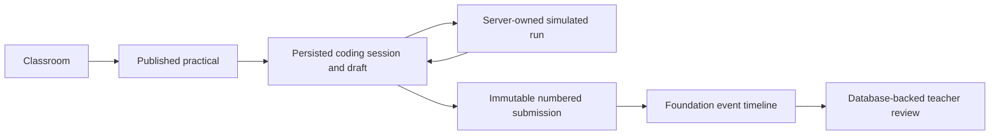

# User flows

## Core flow

## Teacher: create and publish

1. The server resolves either the seeded demo teacher or an explicitly linked Clerk user whose local role is `TEACHER`.
2. The teacher creates a practical with instructions, allowed languages, per-language starter code, at least one visible test, optional hidden tests, and an optional deadline.
3. Labrix validates teacher ownership before saving a draft or publishing.

**Status:** persisted for the demo teacher and explicitly linked active teachers. Automatic teacher provisioning and complete practical management remain planned.

## Student: resume, run, and submit

1. The server resolves either the seeded demo student or an explicitly linked Clerk user whose local role is `STUDENT`, then verifies active classroom membership.
2. Labrix loads the existing active draft unchanged, or creates the first draft from the practical's starter code for the initial allowed language.
3. Monaco edits autosave through a server action. Initial hydration and identical source/language versions are no-ops; actual edits show Saving, Saved, or Save failed and retain the browser buffer on failure.
4. Before the first save, switching language replaces an untouched default template with the matching language template. Edited or previously persisted source is retained.
5. Run saves the current draft, records request/completion events, evaluates visible tests through the server-owned mock provider, and stores its result snapshot.
6. Submit evaluates visible and hidden tests for the exact submitted source, then atomically creates an immutable submission, links the result snapshot, closes the session, and records `SUBMISSION_CREATED`. The student sees visible details and only the hidden pass/total aggregate.
7. Repeating the same request returns the same submission. Reloading after submission starts the next numbered attempt.

**Status:** implemented for the seeded practical in demo mode and linked active students in Clerk mode. Execution is clearly simulated.

## Teacher: review

1. The server resolves the teacher and verifies the local `TEACHER` role plus classroom ownership.
2. Practical progress reads the latest persisted attempt for each enrolled student.
3. Classroom completion counts each active student once when they have at least one immutable submission for the latest published practical; resubmissions do not inflate completion.
4. Review shows the immutable source/result snapshots, separate visible/hidden test details, suggested test score, attempt number, timestamp, run count, and ordered foundation timeline.
5. The teacher may save marks and feedback as a private draft or publish them to the student for that specific immutable attempt.
6. The owner-scoped review queue distinguishes `Needs review`, `Draft saved`, and `Published feedback`; its Needs review filter keeps unfinished private drafts visible, while Reviewed means feedback has been published. It also shows the deterministic integrity review category and reason count without exposing raw source or event records through the queue DTO.
7. The classroom progress route summarizes the latest published practical using one latest immutable attempt per active student: completion, deterministic suggested-score and visible/hidden pass-rate aggregates, published-review status, and neutral attention reasons.
8. Legacy result snapshots remain readable; their undivided passed/total counters contribute as visible-only and do not invent hidden-test data.
9. The submission review derives a teacher-only, versioned evidence section from immutable attempts, results, runs, session timestamps, and foundation events. Missing legacy fields remain explicitly unavailable, and unsupported source-size jumps are not inferred.
10. The teacher detail maps available facts to a neutral integrity review category with explainable reasons. Zero reasons is `LOW_ATTENTION`, one is `REVIEW_RECOMMENDED`, and two or more is `HIGH_REVIEW_PRIORITY`; unavailable facts add no reason.
11. The owning teacher may explicitly generate a transient review brief only from one open submission review. The server rejects overlapping generation for that teacher, reloads the immutable attempt through the ownership boundary, and sends only practical text, language, submitted source, aggregate result summaries, deterministic facts/signals, timing, and version to the configured provider. The in-process fake is the default; explicit complete `groq` configuration enables the prototype external adapter. Submission, class-progress, queue, and student flows never generate briefs automatically or in bulk.
12. The returned draft includes an approach summary, likely bugs/edge cases, evidence explanation, three implementation-specific viva questions with expected answers, one modification task, and constructive feedback. The teacher may edit or discard every field; generation never saves marks, saves a review, or publishes feedback.
13. Student pages and DTOs receive no AI brief or action. No cheating verdict, guilt score, plagiarism accusation, automatic mark, or automated academic decision is produced.

**Status:** implemented for persisted attempts in the seeded classroom, including teacher-authored draft/published reviews on a fixed ten-point scale and owner-scoped latest-practical analytics.

## Teacher: manage roster access

1. The server resolves an active teacher and verifies classroom ownership before returning roster controls.
2. The roster lists active and inactive student memberships with join date and aggregate submission/review context.
3. `Deactivate access` changes only `ClassMembership.active`; it does not delete the user, drafts, runs, submissions, results, events, or reviews.
4. Student classroom and published-practical access immediately fails because every student read/action requires an active membership.
5. `Reactivate access` is owner-only and changes the same membership row back to active, restoring classroom and practical access without duplicating or rewriting history.
6. An inactive existing member cannot self-reactivate with a join code; Labrix directs the student to ask the classroom teacher.
7. Each successful deactivation or reactivation atomically records the classroom, membership, student, acting teacher, action, and server timestamp in a teacher-only audit trail.
8. Regenerating the unique join code invalidates the previous code without changing existing memberships or historical work.

**Status:** implemented for owner teachers on the classroom students/progress route.

## Identity transition

**Current:** `LABRIX_IDENTITY_MODE` explicitly selects `demo` or `clerk`. Demo mode resolves fixed seeded actors and is rejected in production. Clerk mode validates the server session, maps its subject through `ExternalIdentity`, enforces local `ACTIVE` status and role, then applies the existing membership/ownership checks. Browser-supplied user IDs and roles are ignored.

**Unlinked sign-up:** a valid new Clerk account reaches the unlinked-account state. Student onboarding requires a verified Clerk profile and valid active classroom join code, then creates only a local `STUDENT` plus student membership. It cannot select or obtain the teacher role.

**Teacher provisioning:** an administrator runs the guarded non-public provisioning command with a verified Clerk subject. It may explicitly create a new `ACTIVE TEACHER`, or link an explicitly selected existing `ACTIVE TEACHER` by local user ID. It never promotes students or searches by email. Duplicate subjects, disabled users, email collisions, and provider conflicts fail closed. The generic identity linker remains a confirmed non-production recovery command only.

## Failure and security behavior

- Invalid, unenrolled, cross-student, or non-owner access fails in server services.
- Deactivated memberships are treated as unenrolled by classroom, practical, and workspace authorization.
- Autosave failure is visible and does not clear the editor buffer.
- Provider failure creates bounded internal-error feedback and does not execute source locally.
- Missing or invalid Groq configuration, timeout, non-success response, oversized response, malformed JSON, or schema-invalid output produces a bounded teacher-visible retry error without logging provider payloads or secrets.
- Groq HTTP 429 produces **AI provider rate limit reached. Please try again later.** There is no automatic retry, queued job, saved partial output, or page failure.
- Database uniqueness plus idempotency prevents duplicate submissions.
- Submission/result database triggers reject later updates.
