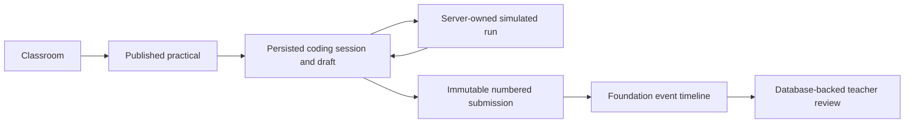

# User flows

## Core flow

## Teacher: create and publish

1. The server resolves either the seeded demo teacher or an explicitly linked Clerk user whose local role is `TEACHER`.
2. The teacher creates a practical with instructions, languages, at least one visible test, optional hidden tests, and an optional deadline.
3. Labrix validates teacher ownership before saving a draft or publishing.

**Status:** persisted for the demo teacher and explicitly linked active teachers. Automatic teacher provisioning and complete practical management remain planned.

## Student: resume, run, and submit

1. The server resolves either the seeded demo student or an explicitly linked Clerk user whose local role is `STUDENT`, then verifies active classroom membership.
2. Labrix loads or creates the one active coding session and draft for the practical attempt.
3. Monaco edits autosave through a server action. Initial hydration and identical source/language versions are no-ops; actual edits show Saving, Saved, or Save failed and retain the browser buffer on failure.
4. Run saves the current draft, records request/completion events, evaluates visible tests through the server-owned mock provider, and stores its result snapshot.
5. Submit evaluates visible and hidden tests for the exact submitted source, then atomically creates an immutable submission, links the result snapshot, closes the session, and records `SUBMISSION_CREATED`. The student sees visible details and only the hidden pass/total aggregate.
6. Repeating the same request returns the same submission. Reloading after submission starts the next numbered attempt.
7. Submission history labels every attempt as read-only, separates the suggested test score from teacher-awarded marks, and shows only whether teacher feedback has been published. Private review drafts remain teacher-only.

**Status:** implemented for the seeded practical in demo mode and linked active students in Clerk mode. Execution is clearly simulated.

## Teacher: review

1. The server resolves the teacher and verifies the local `TEACHER` role plus classroom ownership.
2. Practical progress reads the latest persisted attempt for each enrolled student.
3. Classroom completion counts each active student once when they have at least one immutable submission for the latest published practical; resubmissions do not inflate completion.
4. Review shows the immutable source/result snapshots, separate visible/hidden test details, suggested test score, attempt number, timestamp, run count, and ordered foundation timeline.
5. The teacher may save marks and feedback as a private draft or publish them to the student for that specific immutable attempt.
6. No cheating score, AI summary, or automated academic decision is produced.

**Status:** implemented for persisted attempts in the seeded classroom, including teacher-authored draft/published reviews on a fixed ten-point scale.

## Identity transition

**Current:** `LABRIX_IDENTITY_MODE` explicitly selects `demo` or `clerk`. Demo mode resolves fixed seeded actors and is rejected in production. Clerk mode validates the server session, maps its subject through `ExternalIdentity`, enforces local `ACTIVE` status and role, then applies the existing membership/ownership checks. Browser-supplied user IDs and roles are ignored.

**Unlinked sign-up:** a valid new Clerk account reaches the unlinked-account state. It is not an authenticated Labrix user and receives no role or classroom access. Automatic student creation and join-code onboarding are planned.

**Explicit local verification:** an administrator runs the non-public linking command with an existing Labrix user ID and verified Clerk subject. The command does not match email, create users, change roles, or create teachers.

## Failure and security behavior

- Invalid, unenrolled, cross-student, or non-owner access fails in server services.
- Autosave failure is visible and does not clear the editor buffer.
- Provider failure creates bounded internal-error feedback and does not execute source locally.
- Database uniqueness plus idempotency prevents duplicate submissions.
- Submission/result database triggers reject later updates.
