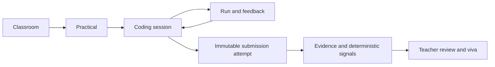

# User flows

## Core flow

## Teacher: create and publish a practical

1. Sign in as a teacher and open an owned classroom.
2. Create a practical with instructions, constraints, allowed languages, visible tests, and an optional deadline.
3. Save an incomplete teacher-only draft or publish a valid practical.
4. Confirm what students will see.

**Current status:** classroom and practical writes are implemented for a hard-coded demo teacher. Real sign-in, reusable authorization, and complete practical management are planned.

## Student: code, run, and submit

1. Sign in, open an enrolled classroom, and choose a published practical.
2. Start or resume a persisted coding session and draft for the selected language.
3. Edit freely. Copy/paste remains available; proportionate paste metadata may become evidence, subject to an approved policy.
4. Run code. Pulse sends it through an isolated execution boundary and shows bounded feedback.
5. Submit explicitly. Pulse creates a new immutable attempt with source and result snapshots.
6. Continue working only in a new draft/attempt; the submitted attempt does not change.

**Current status:** the Monaco workspace and interaction are mock. Source is component state, the autosave label is not backed by storage, execution is simulated, and submission uses tab session state.

## Teacher: review evidence and prepare a viva

1. Open practical progress and select a student attempt.
2. Review submitted source, language, timestamp, and snapshotted test results.
3. Review a neutral timeline and deterministic signals with definitions and underlying facts.
4. Read an AI-assisted summary and feedback draft, clearly labeled as generated.
5. Use implementation-specific viva prompts to verify understanding.
6. Make and record the human academic decision through the institution’s approved process.

**Current status:** progress and review screens are mock; evidence, AI assistance, viva prompts, and decision recording are planned.

## Required failure paths

- Draft autosave failure must be visible and retryable without discarding the local editor buffer.
- Execution timeout/provider failure must not corrupt the draft or create a submission.
- Submission must be idempotent for a single client request and must never overwrite an existing attempt.
- Unauthorized or unenrolled access must fail on the server, not merely hide a link.
- AI unavailability must not block submission or teacher access to deterministic evidence.

