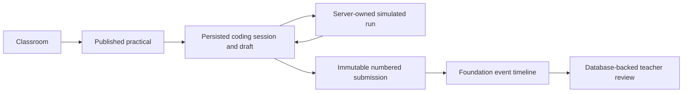

# User flows

## Core flow

## Teacher: create and publish

1. The seeded server-side teacher opens an owned classroom.
2. The teacher creates a practical with instructions, languages, visible tests, and optional deadline.
3. Labrix validates teacher ownership before saving a draft or publishing.

**Status:** persisted for the demo teacher; production authentication and complete practical management remain planned.

## Student: resume, run, and submit

1. The server resolves the seeded student and verifies active classroom membership.
2. Labrix loads or creates the one active coding session and draft for the practical attempt.
3. Monaco edits autosave through a server action. The UI shows Saving, Saved, or Save failed and retains the browser buffer on failure.
4. Run saves the current draft, records request/completion events, calls the server-owned mock provider, and stores its result snapshot.
5. Submit repeats the simulated run for the exact submitted source, then atomically creates an immutable submission, links the result snapshot, closes the session, and records `SUBMISSION_CREATED`.
6. Repeating the same request returns the same submission. Reloading after submission starts the next numbered attempt.

**Status:** implemented for the seeded practical. Execution is clearly simulated.

## Teacher: review

1. The server resolves the seeded teacher and verifies classroom ownership.
2. Practical progress reads the latest persisted attempt for each enrolled student.
3. Review shows the immutable source/result snapshots, attempt number, timestamp, run count, and ordered foundation timeline.
4. No cheating score, AI summary, or automated academic decision is produced.

**Status:** implemented for persisted attempts in the seeded classroom.

## Failure and security behavior

- Invalid, unenrolled, cross-student, or non-owner access fails in server services.
- Autosave failure is visible and does not clear the editor buffer.
- Provider failure creates bounded internal-error feedback and does not execute source locally.
- Database uniqueness plus idempotency prevents duplicate submissions.
- Submission/result database triggers reject later updates.

