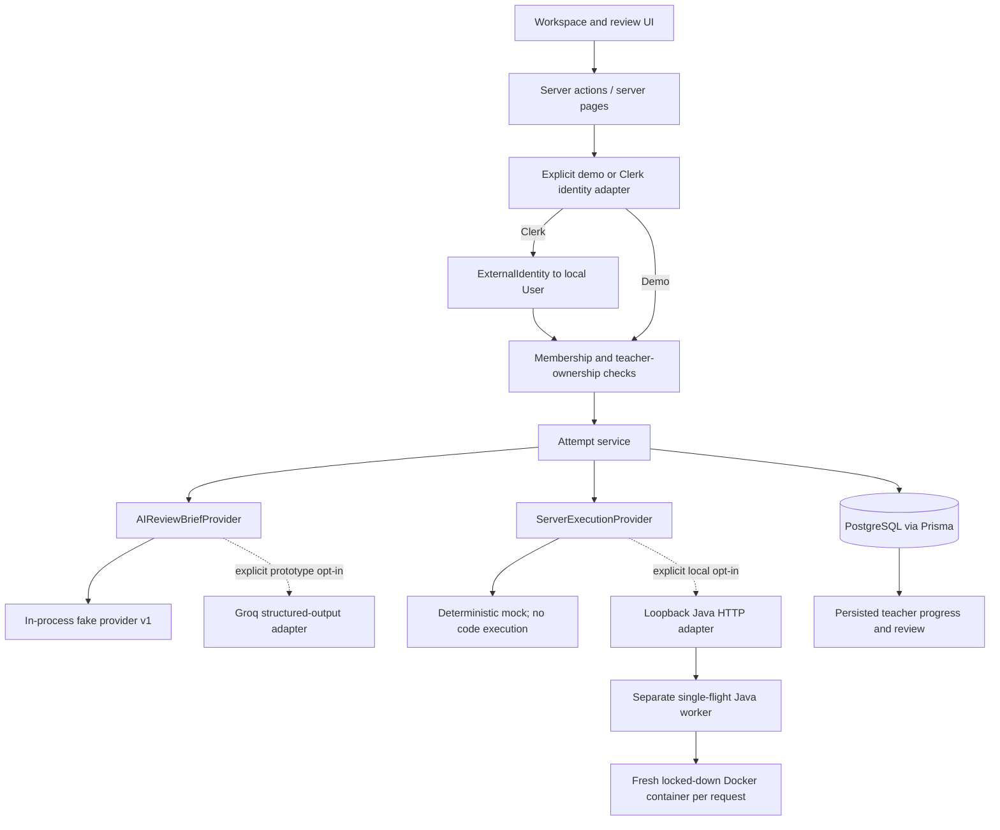
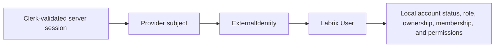

# Architecture

## Current vertical slice

Labrix uses Next.js 16.3 App Router, React 19.2, strict TypeScript, Prisma 6/PostgreSQL, Monaco, Zod, Vitest, and Playwright.

The browser sends resource IDs and source input, never a trusted user ID, provider subject, role, or account status. Every persisted page/action resolves its actor server-side, and services re-check membership/ownership with the requested resource.

Clerk is integrated behind a provider-neutral adapter. The identity foundation stores local `User.accountStatus` and optional `ExternalIdentity` records. Existing demo users require no external identity. The implemented Clerk resolver is:

Clerk establishes identity and session validity only. PostgreSQL remains authoritative for authorization. Email, browser-selected roles, and provider metadata are not identity-linking or authorization inputs. Missing, malformed, unlinked, disabled, or unavailable Clerk identity fails closed.

`src/proxy.ts` performs an optimistic signed-in check and keeps authentication/static routes reachable. It is not the authorization boundary. `resolveCurrentActor()` runs again beside every protected database read or mutation. `demo` mode is local/test-only and production rejects it; `clerk` mode never falls back.

Teacher classroom queries are owner-scoped. Latest-practical completion is derived from active student memberships and distinct submission student IDs. Client autosave compares source/language with the last successfully persisted version; the server repeats that comparison transactionally before changing a draft, timestamp, revision, or event timeline.

Each `Task` may store nullable Java and C++ starter-code fields. Null keeps legacy practicals readable through built-in defaults. A new coding session copies only the selected language template into its mutable `Draft`; later authoring edits never rewrite an existing draft. The workspace swaps templates on language change only while the browser still holds an untouched, never-persisted default.

The teacher review-queue DTO is also classroom-owner scoped. It returns submission metadata, aggregate result status, suggested score, teacher marks, a derived review status, and the deterministic integrity review signal without returning draft feedback text, raw source snapshots, or event records. Student DTOs remain separate and expose only published reviews belonging to that student.

The owner-scoped teacher submission-detail DTO also builds `SubmissionEvidenceFactsV1` in the domain layer from already persisted immutable submission/result data plus its session runs and foundation events. Every nullable legacy or unsupported value has an explicit unavailable state and explanation. The submit-time execution is excluded from latest-successful-run comparison so source matching is meaningful. A separate versioned domain calculator maps only available facts to neutral review-priority categories and reason text; it does not persist or infer misconduct. The separate student detail DTO receives no evidence or integrity-signal object and continues to redact hidden per-test records.

Phase AI-2 adds a separate server-only `AIReviewBriefProvider` boundary. Its action accepts only a submission reference, resolves a teacher session again, and reloads the attempt through `getSubmissionForTeacher()` so classroom ownership is enforced at generation time. The minimized provider DTO omits student/classroom identity, raw events, test IDs, and visible or hidden per-test inputs/outputs; hidden information is aggregate pass/total only. Submitted source and practical text are explicitly untrusted data. Provider output is schema-validated and returned as a bounded transient DTO with provider/model/prompt provenance.

The default provider is deterministic and in-process. It strips source comments before structural heuristics, makes no network call, and cannot execute or follow instructions embedded in source. Explicit `groq` mode constructs a new allowlisted provider payload, calls only Groq's fixed HTTPS chat-completions endpoint with a server-only key and timeout, and validates the model JSON through the existing Zod contract. It never logs keys, prompts, submitted source, provider bodies, or raw responses. A process-local guard permits one active generation per teacher and rejects overlap instead of queueing or retrying; this is demo-load protection, not distributed rate limiting. HTTP 429 maps to a typed safe error and no partial result. No generated output is persisted. The client receives the brief only after the teacher-only action succeeds and may edit or discard it locally; it has no automatic path to marks, saved review feedback, or publication. Student routes import neither the action UI nor an AI brief DTO, and no submission/class workflow invokes generation.

The domain evidence builder and integrity-signal calculator run before provider selection and remain the only authority for facts, thresholds, reasons, and review-priority categories. Providers receive those immutable structured outputs as explanatory context only. Their role is limited to teacher-friendly explanation, code/evidence-grounded viva questions, constructive feedback drafting, and manual inspection suggestions; provider output cannot feed back into or replace deterministic calculation.

The practical-analytics DTO is classroom-owner scoped and read-only. It selects active student memberships and reduces only each student's latest immutable attempt for the selected published practical. It returns aggregate counters, pass rates, review state, and deterministic attention-reason codes; it does not return test-case contents, hidden result details, source code, or draft feedback.

Roster reads and mutations use a server-only classroom service. Deactivation and owner-only reactivation atomically update only the existing membership `active` flag and append a `MembershipAuditEntry` after role and classroom-owner checks; the `(classroomId, userId)` uniqueness constraint prevents duplicate memberships and historical coding/review relations remain untouched. Owner-scoped roster reads return the recent audit trail, while student DTOs do not include it. An inactive member cannot self-reactivate through the join-code action. Join-code regeneration updates the existing unique classroom code, so no invitation record is required for these MVP controls.

## Persisted model

- `CodingSession`: one numbered practical attempt; a partial unique database index permits only one active session per student/practical.
- `Draft`: the one mutable source buffer for a session.
- `RunAttempt`: immutable source used for one server-owned provider request.
- `ResultSnapshot`: provider outcome, per-test JSON, nullable visible/hidden counters, nullable suggested score, and nullable execution mode; updates are rejected by a database trigger. Nullable additions keep legacy snapshots readable without rewriting them.
- `SubmissionAttempt`: numbered exact source plus associated result; updates are rejected by a database trigger.
- `SubmissionReview`: optional mutable teacher-authored marks/feedback attached one-to-one to an immutable attempt; only published reviews are returned to the owning student.
- `CodeEvent`: ordered, server-timestamped foundation events with relevant run/submission IDs.
- `User.accountStatus`: local `ACTIVE`/`DISABLED` lifecycle policy; existing users default to `ACTIVE`.
- `ExternalIdentity`: optional provider/subject link to an existing local user. Composite uniqueness prevents a provider subject from mapping twice and prevents duplicate same-provider identities for one local user.
- `MembershipAuditEntry`: append-only record of owner-authorized membership deactivation/reactivation with classroom, membership, student, acting teacher, optional reason, and server timestamp. Restrictive foreign keys preserve its references.

Submission creation uses a serializable transaction to create the attempt, close the active session, and append its event. Unique constraints enforce attempt numbering, one submission per session, one result per submission, and student-scoped idempotency.

## Route boundary

- **Database-backed:** `/dashboard`, `/classes`, `/classes/[classroomId]`, `/classes/[classroomId]/tasks/new`, `/classes/[classroomId]/tasks/[taskId]/edit`, `/practicals`, `/practicals/[taskId]`, `/progress`, `/tasks/[taskId]`, `/classes/[classroomId]/students`, `/submissions`, and `/submissions/[submissionId]`. Teacher queries are ownership-scoped; student queries are active-membership and resource-ownership scoped.
- **Retired legacy aliases:** `/` redirects to `/dashboard`, `/classes/[classroomId]/tasks` redirects to the filtered persisted `/practicals` route, and `/tasks/[taskId]/my-submissions` redirects to filtered persisted `/submissions`.

`src/app/[[...slug]]/page.tsx` is now a redirect/404 quarantine only. It contains no product UI or mock data: known aliases redirect, while all other unmatched paths call `notFound()`. New product behavior must use explicit routes and server services.

## Execution and evidence boundaries

No student source runs in Next.js. The default server provider only simulates deterministic feedback. The opt-in `java-http` adapter has an HTTP deadline, bounded response parsing, Java-only enforcement, and fail-closed response validation; it never invokes Java, Docker, a shell, or child processes. Its separate loopback worker creates one disposable Java container per request, compiles once, executes ordered test inputs, and enforces CPU, memory, process, filesystem, output, network, and wall-clock limits. The worker is a local single-flight proof only; a production adapter still requires an accepted provider decision, durable queueing, retry/outage policy, image lifecycle, observability, concurrency targets, and abuse testing.

Before provider dispatch, a process-local execution guard serializes work by student and coding session. It rejects overlapping Run or Submit requests, applies a one-second cooldown between Run starts, and leaves Submit retries governed by the existing idempotency key once no execution is active. Rejections happen before a `RunAttempt` or `ResultSnapshot` is created. This is a single-instance abuse and double-click guard, not a distributed production queue; multi-instance deployment still requires shared coordination and rate limiting.

Each server execution provider exposes a runtime descriptor: the default mock is `simulated`, the opt-in loopback Java provider is `java-docker-local`, and the opt-in loopback C++ provider is `cpp-docker-local`. New `ResultSnapshot` rows persist that mode as a nullable enum, so fresh responses and reloaded student/teacher details use the same **Simulated execution**, **Java Docker runner**, or **C++ Docker runner** label. Historical snapshots remain null and disclose **Execution mode unavailable**; provider identity is never inferred from language or the current environment.

The local worker supplies source and one test input at a time over `docker exec` standard input. It does not mount the repository, Docker socket, application environment, or database credentials into the sandbox. The container uses a pinned Java 21 image, a non-root user, a read-only root filesystem, bounded temporary filesystems, no network, no Linux capabilities, and forced cleanup. Hidden expected outputs stay in the worker process and are never written into the container.

Run requests contain visible tests only. Submit requests contain visible and hidden tests. Student DTOs filter out every hidden test record before serialization and return only hidden pass/total counters; owner-scoped teacher DTOs may return the stored hidden details. Suggested scoring is deterministic and separate from teacher-authored marks.

Only five foundation events are captured. Phase AI-0 deterministically counts and explains the records already available; it does not add event collection. Phase AI-1 derives teacher-only review priority from those facts: a session under five minutes, no pre-submission run, submitted source differing from the latest successful pre-submission run, a later draft save, or a stored score of at least 8.0/10 with hidden failures can add a neutral reason. One reason recommends review and two or more set high review priority; unavailable facts never add reasons. Phase AI-2 may explain those records in a teacher-requested draft, and Phase AI-3 may dispatch the same minimized contract to explicitly configured prototype Groq, but neither can alter facts, marks, reviews, or student data. No raw keystrokes, clipboard contents, tab tracking, screen/webcam recording, cheating verdict, guilt score, or plagiarism accusation exists in this slice.
