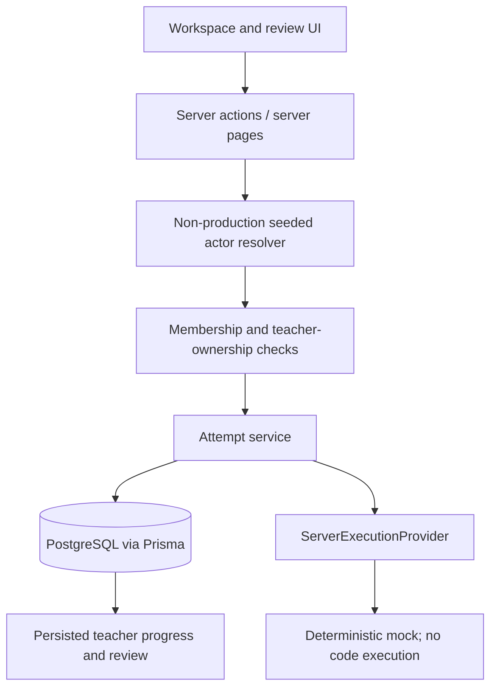

# Architecture

## Current vertical slice

Labrix uses Next.js 16.3 App Router, React 19.2, strict TypeScript, Prisma 6/PostgreSQL, Monaco, Zod, Vitest, and Playwright.

The browser sends resource IDs and source input, never a trusted user ID or role. Server actions resolve the fixed demo actor and services re-check membership/ownership with the requested resource. This boundary is replaceable by real authentication; it is not production identity security.

## Persisted model

- `CodingSession`: one numbered practical attempt; a partial unique database index permits only one active session per student/practical.
- `Draft`: the one mutable source buffer for a session.
- `RunAttempt`: immutable source used for one server-owned provider request.
- `ResultSnapshot`: provider outcome and per-test JSON; updates are rejected by a database trigger.
- `SubmissionAttempt`: numbered exact source plus associated result; updates are rejected by a database trigger.
- `CodeEvent`: ordered, server-timestamped foundation events with relevant run/submission IDs.

Submission creation uses a serializable transaction to create the attempt, close the active session, and append its event. Unique constraints enforce attempt numbering, one submission per session, one result per submission, and student-scoped idempotency.

## Route boundary

- **Database-backed:** `/classes`, `/classes/[classroomId]`, `/classes/[classroomId]/tasks/new`, `/tasks/[taskId]`, `/classes/[classroomId]/students`, and `/submissions/[submissionId]`.
- **Legacy catch-all remains:** unmatched routes such as `/tasks/[taskId]/my-submissions` and `/classes/[classroomId]/tasks`.

Explicit routes take precedence over `src/app/[[...slug]]/page.tsx`. New product behavior should use explicit routes and server services rather than expanding the catch-all.

## Execution and evidence boundaries

No student source runs in Next.js. The current server provider only simulates deterministic feedback. A production adapter must call an isolated runner with explicit time, memory, process, filesystem, output, and network limits.

Only five foundation events are captured. No raw keystrokes, clipboard contents, tab tracking, screen/webcam recording, suspicion signal, cheating score, or AI output exists in this slice.

