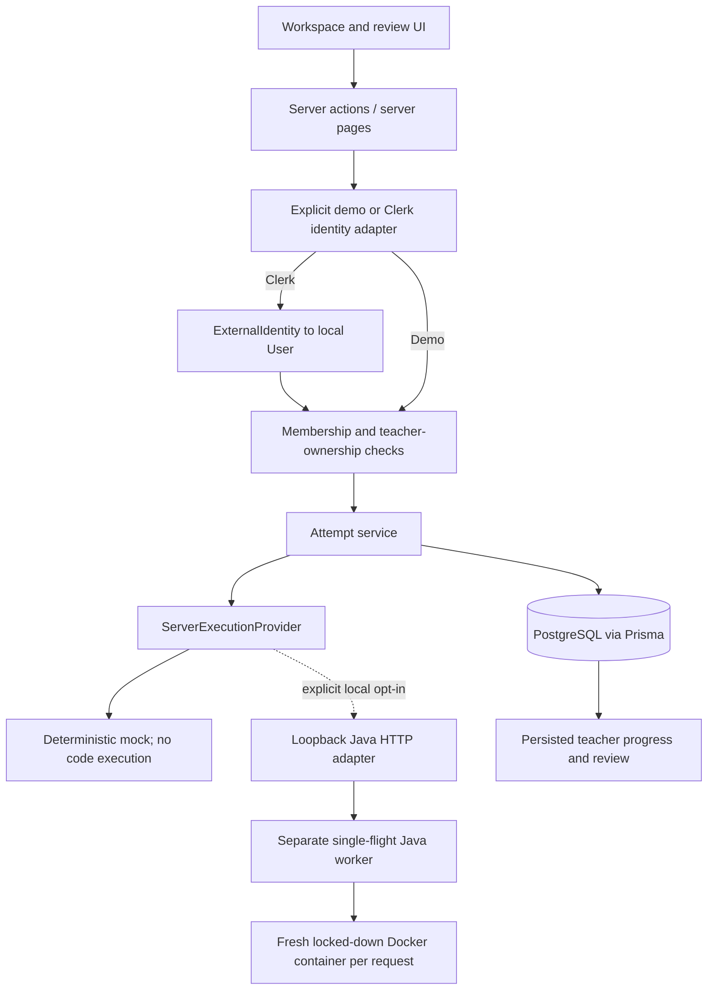
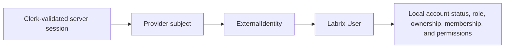

# Architecture

## Current vertical slice

Labrix uses Next.js 16.3 App Router, React 19.2, strict TypeScript, Prisma 6/PostgreSQL, Monaco, Zod, Vitest, and Playwright.

The browser sends resource IDs and source input, never a trusted user ID, provider subject, role, or account status. Every persisted page/action resolves its actor server-side, and services re-check membership/ownership with the requested resource.

Clerk is integrated behind a provider-neutral adapter. The identity foundation stores local `User.accountStatus` and optional `ExternalIdentity` records. Existing demo users require no external identity. The implemented Clerk resolver is:

Clerk establishes identity and session validity only. PostgreSQL remains authoritative for authorization. Email, browser-selected roles, and provider metadata are not identity-linking or authorization inputs. Missing, malformed, unlinked, disabled, or unavailable Clerk identity fails closed.

`src/proxy.ts` performs an optimistic signed-in check and keeps authentication/static routes reachable. It is not the authorization boundary. `resolveCurrentActor()` runs again beside every protected database read or mutation. `demo` mode is local/test-only and production rejects it; `clerk` mode never falls back.

Teacher classroom queries are owner-scoped. Latest-practical completion is derived from active student memberships and distinct submission student IDs. Client autosave compares source/language with the last successfully persisted version; the server repeats that comparison transactionally before changing a draft, timestamp, revision, or event timeline.

Each `Task` may store nullable Java and C++ starter-code fields. Null keeps legacy practicals readable through built-in defaults. A new coding session copies only the selected language template into its mutable `Draft`; later authoring edits never rewrite an existing draft. The workspace swaps templates on language change only while the browser still holds an untouched, never-persisted default.

The teacher review-queue DTO is also classroom-owner scoped. It returns submission metadata, aggregate result status, suggested score, teacher marks, and a derived review status without returning draft feedback text. Student DTOs remain separate and expose only published reviews belonging to that student.

The practical-analytics DTO is classroom-owner scoped and read-only. It selects active student memberships and reduces only each student's latest immutable attempt for the selected published practical. It returns aggregate counters, pass rates, review state, and deterministic attention-reason codes; it does not return test-case contents, hidden result details, source code, or draft feedback.

Roster reads and mutations use a server-only classroom service. Deactivation and owner-only reactivation atomically update only the existing membership `active` flag and append a `MembershipAuditEntry` after role and classroom-owner checks; the `(classroomId, userId)` uniqueness constraint prevents duplicate memberships and historical coding/review relations remain untouched. Owner-scoped roster reads return the recent audit trail, while student DTOs do not include it. An inactive member cannot self-reactivate through the join-code action. Join-code regeneration updates the existing unique classroom code, so no invitation record is required for these MVP controls.

## Persisted model

- `CodingSession`: one numbered practical attempt; a partial unique database index permits only one active session per student/practical.
- `Draft`: the one mutable source buffer for a session.
- `RunAttempt`: immutable source used for one server-owned provider request.
- `ResultSnapshot`: provider outcome, per-test JSON, nullable visible/hidden counters, and nullable suggested score; updates are rejected by a database trigger. Nullable additions keep legacy snapshots readable without rewriting them.
- `SubmissionAttempt`: numbered exact source plus associated result; updates are rejected by a database trigger.
- `SubmissionReview`: optional mutable teacher-authored marks/feedback attached one-to-one to an immutable attempt; only published reviews are returned to the owning student.
- `CodeEvent`: ordered, server-timestamped foundation events with relevant run/submission IDs.
- `User.accountStatus`: local `ACTIVE`/`DISABLED` lifecycle policy; existing users default to `ACTIVE`.
- `ExternalIdentity`: optional provider/subject link to an existing local user. Composite uniqueness prevents a provider subject from mapping twice and prevents duplicate same-provider identities for one local user.
- `MembershipAuditEntry`: append-only record of owner-authorized membership deactivation/reactivation with classroom, membership, student, acting teacher, optional reason, and server timestamp. Restrictive foreign keys preserve its references.

Submission creation uses a serializable transaction to create the attempt, close the active session, and append its event. Unique constraints enforce attempt numbering, one submission per session, one result per submission, and student-scoped idempotency.

## Route boundary

- **Database-backed:** `/dashboard`, `/classes`, `/classes/[classroomId]`, `/classes/[classroomId]/tasks/new`, `/classes/[classroomId]/tasks/[taskId]/edit`, `/practicals`, `/practicals/[taskId]`, `/progress`, `/tasks/[taskId]`, `/classes/[classroomId]/students`, `/submissions`, and `/submissions/[submissionId]`. Teacher queries are ownership-scoped; student queries are active-membership and resource-ownership scoped.
- **Retired legacy aliases:** `/` redirects to `/dashboard`, `/classes/[classroomId]/tasks` redirects to the filtered persisted `/practicals` route, and `/tasks/[taskId]/my-submissions` redirects to filtered persisted `/submissions`.

`src/app/[[...slug]]/page.tsx` is now a redirect/404 quarantine only. It contains no product UI or mock data: known aliases redirect, while all other unmatched paths call `notFound()`. New product behavior must use explicit routes and server services.

## Execution and evidence boundaries

No student source runs in Next.js. The default server provider only simulates deterministic feedback. The opt-in `java-http` adapter has an HTTP deadline, bounded response parsing, Java-only enforcement, and fail-closed response validation; it never invokes Java, Docker, a shell, or child processes. Its separate loopback worker creates one disposable Java container per request, compiles once, executes ordered test inputs, and enforces CPU, memory, process, filesystem, output, network, and wall-clock limits. The worker is a local single-flight proof only; a production adapter still requires an accepted provider decision, durable queueing, retry/outage policy, image lifecycle, observability, concurrency targets, and abuse testing.

Each server execution provider exposes a runtime descriptor: the default mock is `simulated` and the opt-in loopback Java provider is `java-docker-local`. Fresh Run and newly created Submit responses carry that descriptor to the workspace as **Simulated execution** or **Java Docker runner**. Provider identity is intentionally not inferred from language or current environment. Because `RunAttempt` and `ResultSnapshot` do not persist it, reloaded submission and teacher-review DTOs disclose **Execution mode unavailable** rather than risk mislabeling historical results.

The local worker supplies source and one test input at a time over `docker exec` standard input. It does not mount the repository, Docker socket, application environment, or database credentials into the sandbox. The container uses a pinned Java 21 image, a non-root user, a read-only root filesystem, bounded temporary filesystems, no network, no Linux capabilities, and forced cleanup. Hidden expected outputs stay in the worker process and are never written into the container.

Run requests contain visible tests only. Submit requests contain visible and hidden tests. Student DTOs filter out every hidden test record before serialization and return only hidden pass/total counters; owner-scoped teacher DTOs may return the stored hidden details. Suggested scoring is deterministic and separate from teacher-authored marks.

Only five foundation events are captured. No raw keystrokes, clipboard contents, tab tracking, screen/webcam recording, suspicion signal, cheating score, or AI output exists in this slice.
