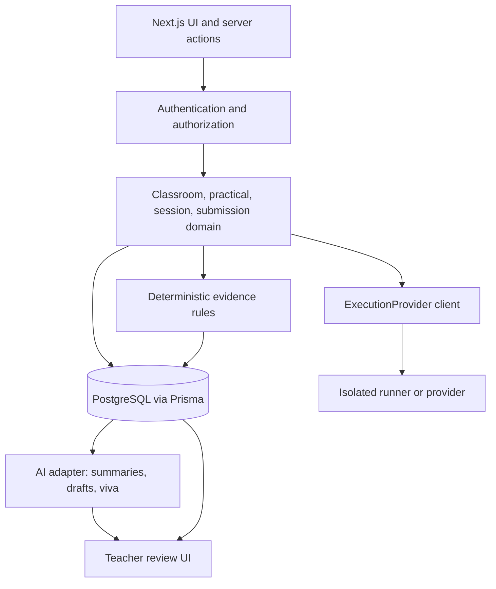

# Architecture

## Current architecture

The repository uses Next.js 16.3 App Router and React 19.2 with strict TypeScript. PostgreSQL is accessed through Prisma 6. Classroom and practical server actions validate input with Zod. Monaco is dynamically loaded in a client catch-all route. Vitest covers selected domain/validation/provider rules; Playwright covers one demo journey.

The current implementation has two data paths:

- `/classes`, `/classes/[classroomId]`, and `/classes/[classroomId]/tasks/new` use Prisma-backed server pages/actions.
- `/tasks/*`, `/submissions/*`, student progress, and several fallback pages are rendered by `src/app/[[...slug]]/page.tsx` from typed mock data and client/session state.

Authentication is not implemented. `getDemoTeacher()` and the hard-coded demo student are temporary actors; the session-scoped role selector changes presentation only.

## Target MVP boundaries

- **Web boundary:** renders UI, validates requests, authorizes access, orchestrates domain services, and never executes student programs.
- **Persistence boundary:** stores identities, memberships, practicals, current drafts/sessions, immutable attempts, result snapshots, evidence events/signals, and AI-output provenance.
- **Execution boundary:** sends source and tests to an isolated system with explicit language, time, memory, process, filesystem, output, and network limits.
- **Evidence boundary:** records approved lightweight events and calculates versioned deterministic signals. It must preserve the facts behind every displayed signal.
- **AI boundary:** consumes the minimum approved context and returns advisory, labeled output. Submission and deterministic review remain available if AI fails.

## Route inventory

- **Explicit, database-backed:** `/classes`, `/classes/[classroomId]`, `/classes/[classroomId]/tasks/new`.
- **Catch-all demo behavior:** `/`, `/tasks/[taskId]`, `/tasks/[taskId]/my-submissions`, `/submissions/[submissionId]`, `/classes/[classroomId]/students`, `/classes/[classroomId]/tasks`, and other unmatched paths.

Before implementing a route, confirm whether the explicit route or optional catch-all will resolve it and remove ambiguity deliberately rather than extending the catch-all.

## Data integrity rules

- A current draft is mutable and uniquely scoped to student, practical, and language (or to a documented session model).
- A submission attempt is append-only after creation. Snapshot source, language, practical/test version, and results needed for later review.
- Evidence derived from an attempt retains event/rule version and provenance.
- Practical edits must not retroactively change a historical attempt’s displayed test facts.
- Database transactions must make attempt creation and its required snapshots atomic.

## Operational constraints

- Do not place runner credentials or AI secrets in client bundles.
- Apply server authorization to every read and write using the authenticated user and classroom membership.
- Define retention, deletion, consent/notice, and access logging before collecting process evidence in production.
- Treat execution and AI providers as replaceable adapters, not route-level vendor calls.

