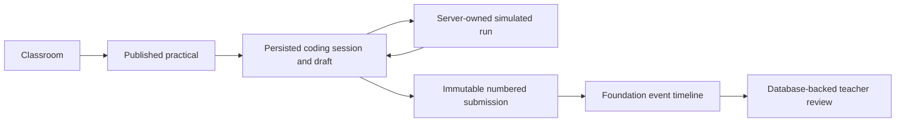

# User flows

## Core flow

## Teacher: create and publish

1. The server resolves either the seeded demo teacher or an explicitly linked Clerk user whose local role is `TEACHER`.
2. The teacher creates a practical with student-facing instructions, available languages, per-language starter code, optional visible/hidden automated tests, a marking setup, and an optional deadline. The form explains that automated results may suggest a score while teachers award final marks, summarizes the device-local deadline in readable language, and serializes it as an absolute instant before the server action.
3. TRACE validates teacher ownership before saving a draft or publishing.

**Status:** persisted for the demo teacher and approved Clerk teachers. A Clerk teacher role creates a pending local request, emails the configured administrator, and remains blocked until signed-link approval. Complete practical management remains planned.

## Student: resume, run, and submit

The Practicals page separates `To do`, `In progress`, `Submitted`, and `Feedback available`. These states describe the student workflow, while test outcomes and teacher review remain separate.

1. The server resolves either the seeded demo student or an explicitly linked Clerk user whose local role is `STUDENT`, then verifies active classroom membership.
2. TRACE loads the existing active draft unchanged, or creates the first draft from the practical's starter code for the initial allowed language.
3. Monaco edits autosave through a server action. Initial hydration and identical source/language versions are no-ops; actual edits show Saving, Saved, or Save failed and retain the browser buffer on failure.
4. Before the first save, switching language replaces an untouched default template with the matching language template. Edited or previously persisted source is retained.
5. Run saves the current draft and records a durable request. Local development may execute inline through the mock provider; production displays queue position while the Google Cloud worker evaluates visible tests and stores the result snapshot.
6. Submit durably queues the exact submitted source, evaluates visible and hidden tests, then atomically creates an immutable submission, links the result snapshot, closes the session, and records `SUBMISSION_CREATED`. Browser closure or web deployment does not discard the queued job. The student sees visible details and only the hidden pass/total aggregate.
7. Repeating the same request returns the same submission. Reloading after submission starts the next numbered attempt.
8. Practical details explain autosave, languages, deadline, visible and hidden tests, permanent submission, and repeat attempts before coding begins. Submission results state that starting another attempt preserves the previous immutable submission.

**Status:** implemented for the seeded practical in demo mode and linked active students in Clerk mode. Execution is clearly simulated.

## Teacher: review

1. The server resolves the teacher and verifies the local `TEACHER` role plus classroom ownership.
2. Practical progress reads the latest persisted attempt for each enrolled student.
3. Classroom completion counts each active student once when they have at least one immutable submission for the latest published practical; resubmissions do not inflate completion.
4. Review shows the immutable source/result snapshots, separate visible/hidden test details, suggested test score, attempt number, timestamp, run count, and ordered foundation timeline.
5. The teacher may save marks and feedback as a private draft or publish them to the student for that specific immutable attempt.
6. The owner-scoped review queue separates `New`, `Draft saved`, `Published`, and `All`, so a saved private draft cannot be mistaken for untouched work or student-visible feedback.
7. Review presents the submission summary, source, tests, optional activity, then marks and feedback. The recent queue and activity remain collapsed until needed.
8. The Progress route can show all owned classrooms or one selected class. It uses one latest immutable attempt per student/practical pair and presents submission coverage, **Passed all provided tests**, and published-review status as separate facts; submitting a compilation error never implies a successful learning outcome.
9. Legacy result snapshots remain readable; their undivided passed/total counters contribute as visible-only and do not invent hidden-test data.
10. No cheating score, AI summary, or automated academic decision is produced.

**Status:** implemented for persisted attempts in the seeded classroom, including configurable practical marks, optional rubric criteria, teacher-authored draft/published reviews, and owner-scoped class progress.

## Teacher: manage roster access

1. The server resolves an active teacher and verifies classroom ownership before returning roster controls.
2. The Students and access page is separate from learning progress. It lists active and inactive memberships with join date and aggregate submission/review context, while the class header links to the filtered Progress page.
3. `Deactivate access` changes only `ClassMembership.active`; it does not delete the user, drafts, runs, submissions, results, events, or reviews.
4. Student classroom and published-practical access immediately fails because every student read/action requires an active membership.
5. `Reactivate access` is owner-only and changes the same membership row back to active, restoring classroom and practical access without duplicating or rewriting history.
6. An inactive existing member cannot self-reactivate with a join code; TRACE directs the student to ask the classroom teacher.
7. Each successful deactivation or reactivation atomically records the classroom, membership, student, acting teacher, action, and server timestamp in a teacher-only audit trail.
8. Regenerating the unique join code invalidates the previous code without changing existing memberships or historical work.

**Status:** implemented for owner teachers on the classroom Students and access route, with learning progress kept on the separate filtered Progress route.

## Identity transition

**Current:** `LABRIX_IDENTITY_MODE` explicitly selects `demo` or `clerk`. Demo mode resolves fixed seeded actors and is rejected in deployed production. A supervised loopback-only professor-demo launcher may use the exact production-build acknowledgement solely to remove development UI from a local evaluation; it remains visibly labeled as a demo. **Preview as teacher/student** appears only on routes that render both seeded views and never changes authentication, authorization, or the actor used by role-specific actions. Clerk mode validates the server session, maps its subject through `ExternalIdentity`, denies disabled and pending-teacher accounts, enforces local role, then applies the existing membership/ownership checks. Browser-supplied user IDs and roles are ignored.

**Unlinked sign-up:** a valid new Clerk account reaches the unlinked-account state. It is not an authenticated TRACE user and receives no role or classroom access. Automatic student creation and join-code onboarding are planned.

**Explicit local verification:** an administrator runs the non-public linking command with an existing TRACE user ID and verified Clerk subject. The command does not match email, create users, change roles, or create teachers.

## Failure and security behavior

- Invalid, unenrolled, cross-student, or non-owner access fails in server services.
- Deactivated memberships are treated as unenrolled by classroom, practical, and workspace authorization.
- Autosave failure is visible and does not clear the editor buffer.
- Provider failure creates bounded internal-error feedback and does not execute source locally.
- Database uniqueness plus idempotency prevents duplicate submissions.
- Submission/result database triggers reject later updates.

## Interface clarity conventions

- Every main page header states the page purpose and exposes one primary next action; additional actions remain secondary.
- Empty and error states explain what happened and provide one safe next step.
- A page-level primary action is not repeated inside an immediately adjacent empty state.
- Dense roster tables become labeled student or access-history cards below the tablet breakpoint; mobile users do not need horizontal scrolling to find the primary action.
- Buttons and headings use sentence case. Generic labels such as “Open class” and “What needs you” are replaced with task-specific language.
- Full-page error and not-found states expose one `h1`, labeled controls, 44-pixel interactive targets, and layouts that do not introduce horizontal page overflow at mobile width.
