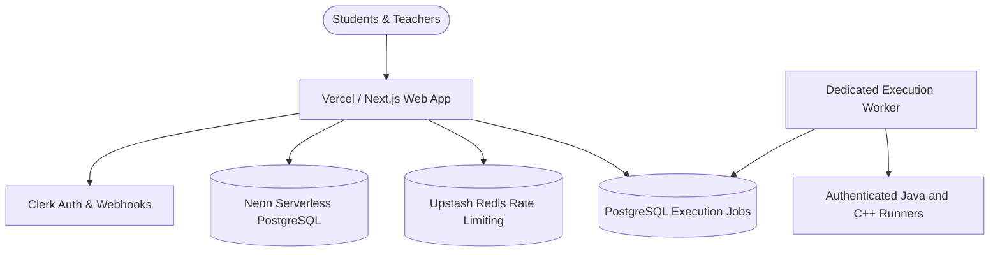

# TRACE production deployment guide

This guide deploys TRACE with a serverless web application, Clerk, PostgreSQL,
Upstash rate limiting, and a dedicated Linux execution host. External AI is not
required for the MVP; the active review UI uses deterministic source-based oral-defense prompts.

---

## 🏗️ Production Architecture Overview



---

## 📋 Step 1: Managed Database Setup (Neon or Supabase)

1. Create a free project at [Neon.tech](https://neon.tech) or [Supabase](https://supabase.com).
2. Create a PostgreSQL database named `labrix`.
3. Copy the connection string required by your hosting provider and set it as `DATABASE_URL`. Run migrations from a controlled release job that can reach the database.
4. Run database migrations:
   ```bash
   npx prisma migrate deploy --schema=backend/prisma/schema.prisma
   ```

---

## 🔐 Step 2: Clerk Authentication & Realtime Webhook Sync

1. Create a production application on [Clerk.com](https://clerk.com).
2. Enable Email, Google, and GitHub sign-in. Set `NEXT_PUBLIC_CLERK_SOCIAL_CONNECTIONS_ENABLED=true` so the configured social buttons are visible.
3. In Clerk Dashboard $\rightarrow$ **Webhooks**:
   - Add Endpoint: `https://your-domain.com/api/webhooks/clerk`
   - Subscribe to events:
     - `user.created`
     - `user.updated`
     - `user.deleted`
   - Copy the **Signing Secret** (`whsec_...`) $\rightarrow$ Set as `CLERK_WEBHOOK_SECRET`.

---

## 🚢 Step 3: Deploying to Vercel (Recommended)

1. Import your GitHub repository into [Vercel](https://vercel.com).
2. Set Framework Preset to **Next.js**.
3. Set Root Directory to `./` (repository root).
4. In **Build & Development Settings**:
   - Build Command: `npm run build`
   - Install Command: `npm ci`
5. In **Environment Variables**, add the following keys from `.env.production.example`:

| Environment Variable | Value / Description |
| :--- | :--- |
| `DATABASE_URL` | Pooled Postgres connection URL |
| `LABRIX_IDENTITY_MODE` | `clerk` |
| `NEXT_PUBLIC_CLERK_PUBLISHABLE_KEY` | `pk_live_...` |
| `CLERK_SECRET_KEY` | `sk_live_...` |
| `CLERK_WEBHOOK_SECRET` | `whsec_...` |
| `UPSTASH_REDIS_REST_URL` | Upstash Redis REST endpoint |
| `UPSTASH_REDIS_REST_TOKEN` | Upstash Redis REST credential |
| `LABRIX_EXECUTION_PROVIDER` | `remote-docker` |
| `LABRIX_EXECUTION_DISPATCH` | `queued` |
| `LABRIX_JAVA_RUNNER_URL` | Public or private HTTPS execution endpoint |
| `LABRIX_CPP_RUNNER_URL` | Public or private HTTPS execution endpoint |
| `LABRIX_RUNNER_BEARER_TOKEN` | Shared random credential, at least 32 characters |
| `NODE_ENV` | `production` |

6. Deploy. Do not open enrollment until the worker heartbeat and runner checks are healthy.

---

## 🛡️ Step 4: Untrusted Code Runner and Execution Worker

For executing untrusted student C++ and Java code in isolated containers:

1. Provision a dedicated Linux Docker host. Do not colocate the runners with business data or the database.
2. Follow `deployment/runner/README.md`. The bundle starts both authenticated runners, Caddy, and the durable execution worker.
3. Set Vercel's `LABRIX_EXECUTION_PROVIDER` to `remote-docker`, point both runner URL variables at their HTTPS origins, and use the same random 32+ character bearer token on Vercel and the runner host.
4. Verify the public boundary before enabling a class:
   ```bash
   npm run verify:runners:remote
   ```

Never expose the Docker daemon or either runner execution endpoint without bearer authentication.

---

## 🩺 Step 5: Production Health & Observability Check

Verify your live deployment by hitting the health check endpoint:
```bash
curl https://your-domain.com/api/health
```

Expected output:
```json
{
  "status": "healthy",
  "version": "0.1.0",
  "uptime": 12450,
  "database": {
    "status": "connected",
    "latencyMs": 8
  },
  "configuration": {
    "status": "valid",
    "warnings": [],
    "missingRequired": []
  },
  "executionQueue": {
    "queued": 0,
    "running": 0,
    "failed": 0,
    "workersOnline": 1,
    "capacity": 8
  }
}
```

Complete the release gate and the pre-class checklist in `documentation/12-OPERATIONS-RUNBOOK.md` before opening enrollment. A successful deployment alone is not evidence that authentication, email delivery, runner capacity, backups, and role-specific classroom flows work in the target environment.

Run the repository release gate before every production push:

```bash
npm run release:gate
```

Do not add `LABRIX_TEST_DATABASE_URL` to Vercel. That variable is only for isolated local/CI verification and must never point production runtime at a test database.
